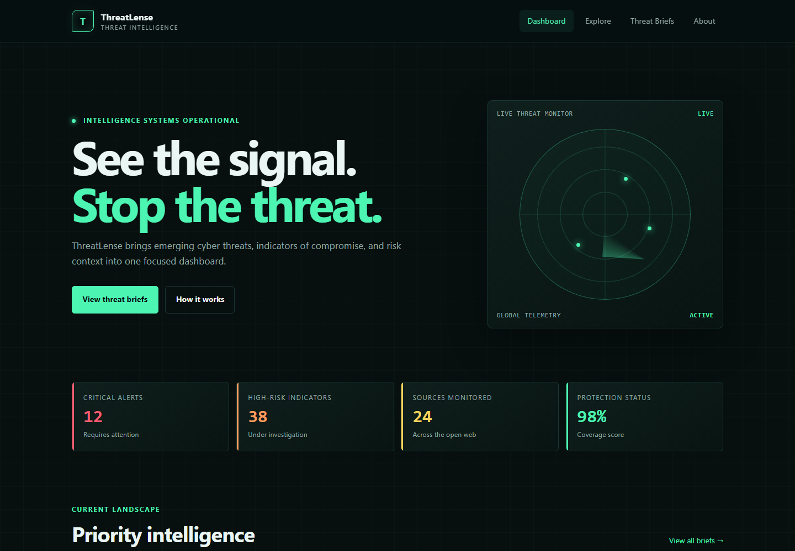
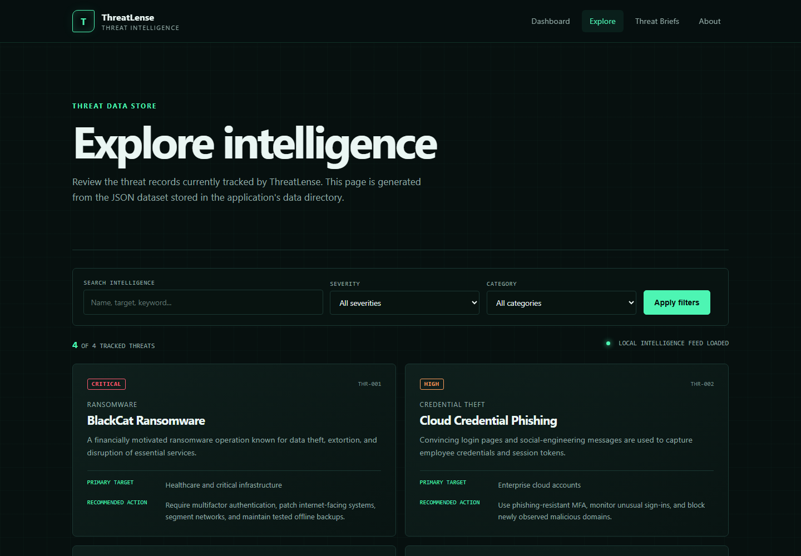
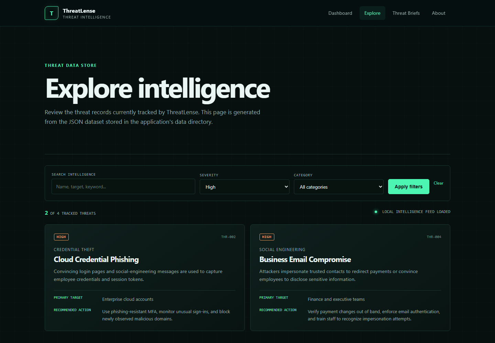

# ThreatLense

- **Application:** ThreatLense
- **Student:** Nancy Perez
- **Course:** IT401
- **Assignment:** Semester Project - Assignment 1

## Project Overview

ThreatLense is a Flask-based cybersecurity threat intelligence dashboard. Its purpose is to organize threat information into a clear interface where users can review emerging risks, understand affected targets, and find practical mitigation guidance.

The application is intended for cybersecurity students, junior security analysts, small organizations, and other users who need an approachable introduction to threat intelligence. Security information is often scattered across multiple sources and filled with technical detail. ThreatLense addresses this problem by presenting the most important context—severity, category, target, description, and recommended action—in a consistent and readable format.

> The threat records currently included in the project are demonstration data and should not be treated as a live security advisory.

## Preliminary Semester Project Concept

The planned direction for ThreatLense is to develop it into a more complete threat intelligence application that can collect, organize, search, and explain cybersecurity threat data. The dashboard will emphasize usability so that people with different levels of security experience can quickly identify high-priority information.

Major features planned for the semester include:

- A dashboard summarizing the current threat landscape
- Threat records loaded from structured data sources
- Keyword, severity, and category filtering
- Detailed pages for individual threats
- External cybersecurity data or API integration
- User-friendly mitigation and response recommendations
- Improved data visualization and trend reporting
- Stronger validation, error handling, and automated tests

This preliminary concept may be refined after Module 2 as the project requirements and information model become more detailed.

## Current Features

- **Homepage:** A responsive cybersecurity dashboard with threat metrics, priority intelligence cards, and a live-monitor visual treatment.
- **Navigation:** A reusable navigation bar and footer provided by the shared `base.html` template.
- **JSON data display:** The `/explore` route reads threat records from `data/threats.json` and renders them as cards.
- **Filtering functionality:** Users can search across threat fields and filter records by severity or category. Filters can also be combined.
- **Threat briefs:** A dedicated page presents concise analyst-style summaries and recommended actions.
- **About page:** Explains the application's purpose, principles, and intended workflow.
- **Responsive design:** Layouts adapt to desktop, tablet, and mobile screen sizes.

## Information Model (Conceptual)

ThreatLense will manage cybersecurity intelligence about threats, their targets, and the defensive actions users can take. The current core entity is a **Threat**.

| Entity | Attribute | Description |
| --- | --- | --- |
| Threat | `id` | Unique identifier for the threat record |
| Threat | `name` | Human-readable threat name |
| Threat | `category` | Type of activity, such as ransomware or credential theft |
| Threat | `severity` | Relative risk level, such as critical, high, or medium |
| Threat | `target` | Industries, systems, or users commonly affected |
| Threat | `description` | Summary of the threat and its behavior |
| Threat | `mitigation` | Recommended defensive or response action |

Future versions may add related entities such as threat actors, indicators of compromise, affected products, intelligence sources, and incident timelines. This is a conceptual model only; no database schema is required at this stage.

## Project Structure

```text
threatlense/
|-- app.py                    # Flask application factory and entry point
|-- config.py                 # Development and production configuration
|-- requirements.txt          # Python dependencies
|-- data/
|   `-- threats.json          # Local JSON threat data store
|-- models/                   # Future application data models
|-- routes/
|   `-- main.py               # Page routes and filtering logic
|-- services/                 # Search, API, and AI service modules
|-- static/
|   `-- style.css             # Shared responsive visual design
|-- templates/
|   |-- base.html             # Shared title, navigation, CSS link, and footer
|   |-- index.html            # Dashboard homepage
|   |-- explore.html          # JSON display and filter interface
|   |-- menu.html             # Threat briefs page
|   `-- about.html            # Project description and mission
|-- tests/
|   `-- test_app.py           # Flask route and filtering tests
`-- README.md                 # Primary project documentation
```

## Installation Instructions

### Prerequisites

- Python 3.10 or newer
- Git

### 1. Clone the repository

```bash
git clone https://github.com/NPEREZ13/nancyperez-it401-final-project.git
cd nancyperez-it401-final-project
```

### 2. Create a virtual environment

```bash
python -m venv .venv
```

Activate it on Windows PowerShell:

```powershell
.venv\Scripts\Activate.ps1
```

Activate it on macOS or Linux:

```bash
source .venv/bin/activate
```

### 3. Install dependencies

```bash
python -m pip install -r requirements.txt
```

### 4. Run the application

```bash
python app.py
```

Open [http://127.0.0.1:5000](http://127.0.0.1:5000) in a web browser.

### Run the tests

```bash
python -m pytest
```

## Screenshots

### Homepage

The homepage provides a high-level view of threat metrics and priority intelligence.



### Explore Page

The Explore page displays records loaded from the local JSON data store.



### Filtering Feature

The Explore page can narrow records using keyword, severity, and category filters. This example displays only high-severity threats.



## Future Work

For Assignment 2, planned enhancements include moving data-access and filtering responsibilities into a dedicated service layer, adding detailed threat pages, expanding the JSON dataset, and improving validation and error handling. The project may also begin integrating a trusted external cybersecurity API so dashboard information can move beyond demonstration data. Additional automated tests will cover the expanded service and route behavior.
